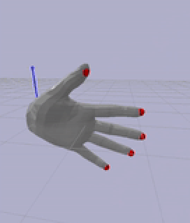

# MANO IK

## Functionality
This repo contains a basic IK implementation for use on human hand models. The model used in the original code is derived from [MANO](https://mano.is.tue.mpg.de/). The notebook provides a basic demo of the IK functionality.

